Lập trình R trong môi trường Windows, đôi khi chúng ta sẽ gặp một số hạn chế mà không được Windows hỗ trợ. Ví dụ như với Parallel Computing thì forking không được hỗ trợ, hay đôi khi chúng ta sẽ gặp các lỗi liên quan đến việc hiển thị ký tự Unicode,...Những vấn đề này, hầu như đều không xuất hiện trong môi trường Linux.

WSL (Windows Subsystem for Linux) là một tính năng có sẵn trên Windows. Nó cho phép bạn chạy các hệ điều hành Linux trên Windows. Với WSL, bạn có thể chạy các ứng dụng, câu lệnh Linux trực tiếp từ dòng lệnh Windows như Terminal, Vim, Emacs...

---

## 1. Cài đặt WSL2 

### 1.1. Yêu cầu

Yêu cầu cơ bản nhất khi cài đặt WSL2 là các bạn phải sử dụng hệ điều hành Windows 10 version 1903 trở lên, và là bản update mới nhất. Windows của các bạn cũng phải hỗ trợ Microsoft Store, vì một số ứng dụng cài trực tiếp từ trên này.

Để kiểm tra version Windows đang sử dụng, các bạn dùng tổ hợp phím `Windows + R` hoặc tìm ứng dụng Run trong Windows, rồi gõ `winver`. Kết quả như sau:

<p align="center">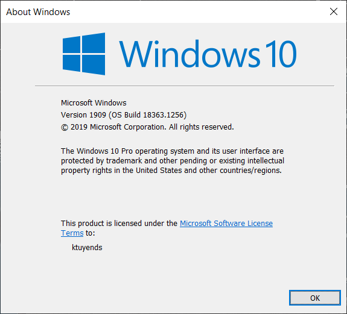</p>

### 1.2. Bật tính năng WSL và Virtual Machine Platform

Mở Powershell với quyền Admin. Và chạy lần lượt các lệnh dưới đây để bật 2 tính năng trên:

```bash
dism.exe /online /enable-feature /featurename:Microsoft-Windows-Subsystem-Linux /all /norestart
```

```bash
dism.exe /online /enable-feature /featurename:VirtualMachinePlatform /all /norestart
```

Sau khi hoàn thành, hãy RESTART lại máy tính để nó hoàn tất việc cài đặt. Cuối cùng, các bạn mở lại Powershell với quyền Admin và chạy lệnh dưới đây để cài đặt chế độ sử dụng mặc định là WSL2.

```bash
wsl --set-default-version 2
```

Nếu lần đầu các bạn cài đặt, có thể sẽ gặp phải thông báo như này: *WSL 2 requires an update to its kernel component. For information
please visit https://aka.ms/wsl2kernel*, có nghĩa là máy tính của bạn chưa cài đặt nhân Linux. Các bạn vào link https://aka.ms/wsl2kernel, tải file cài đặt về và cài đặt. Sau khi xong thì chạy lại lệnh trên.

Minh họa bằng hình ảnh:

<p align="center">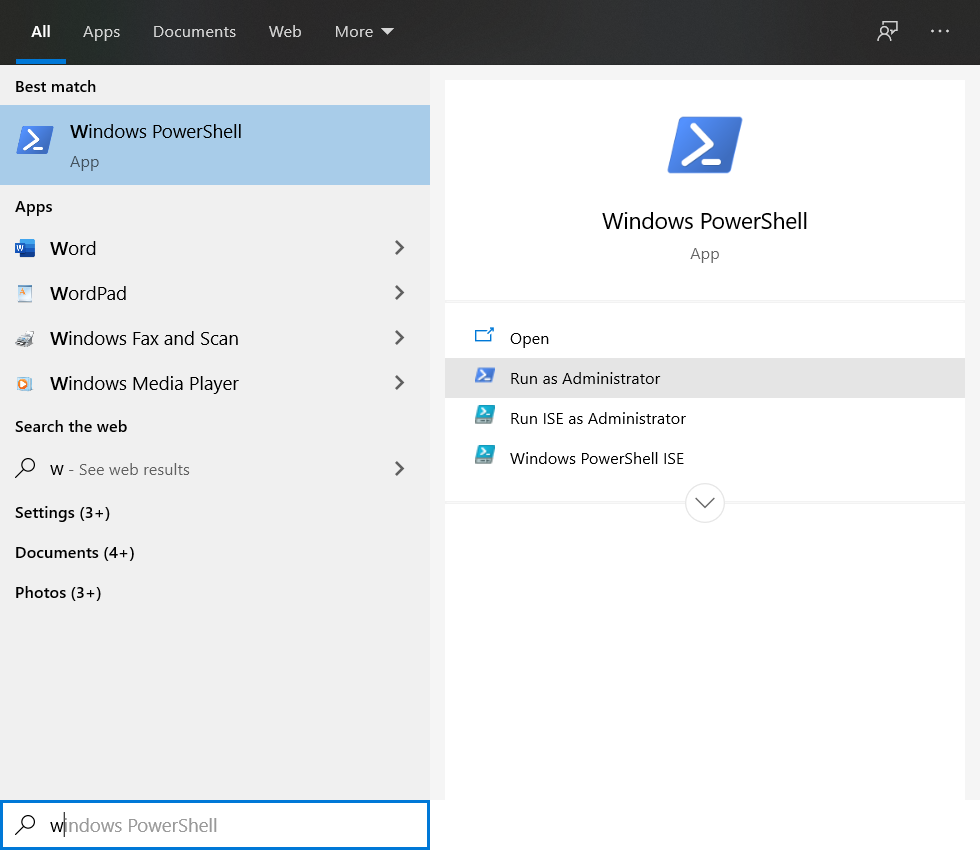</p>

<p align="center">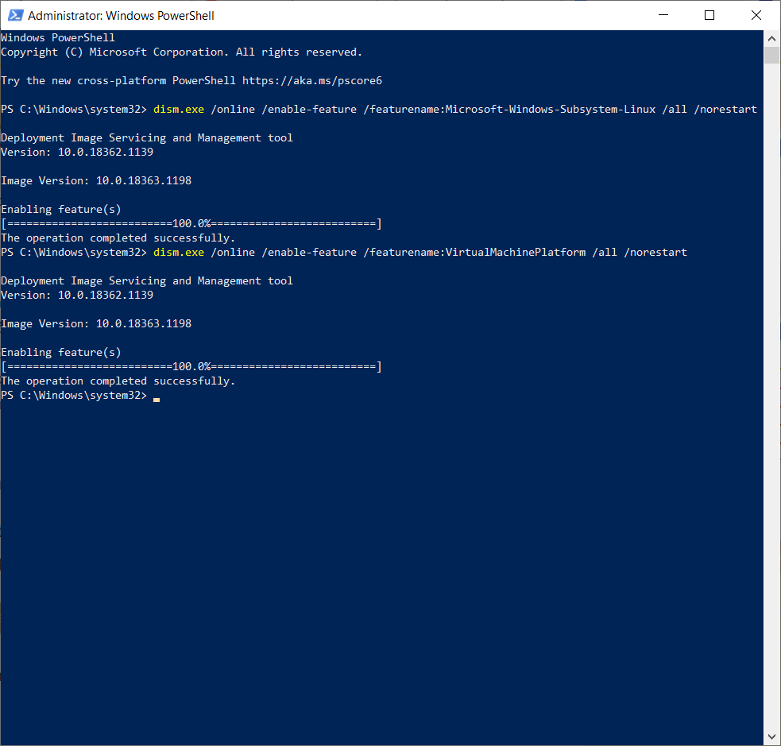</p>

### 1.3. Cài đặt và chạy Ubuntu và Windows Terminal

Hai ứng dụng này, được cài đặt trực tiếp từ [Microsoft Store](https://aka.ms/wslstore):

* [Ubuntu 20.04 LTS](https://www.microsoft.com/vi-vn/p/ubuntu-2004-lts/9n6svws3rx71?rtc=1&activetab=pivot:overviewtab)
* [Windows Terminal](https://www.microsoft.com/vi-vn/p/windows-terminal/9n0dx20hk701?rtc=1&activetab=pivot:overviewtab)

Sau khi cài đặt xong, hãy bật Ubuntu lên. Lần đầu chạy Ubuntu, nó sẽ hỏi các bạn nhập user và password. Lưu ý là lúc nhập password nó sẽ không hiện gì hết, các bạn cứ nhập bình thường nha. 

<p align="center">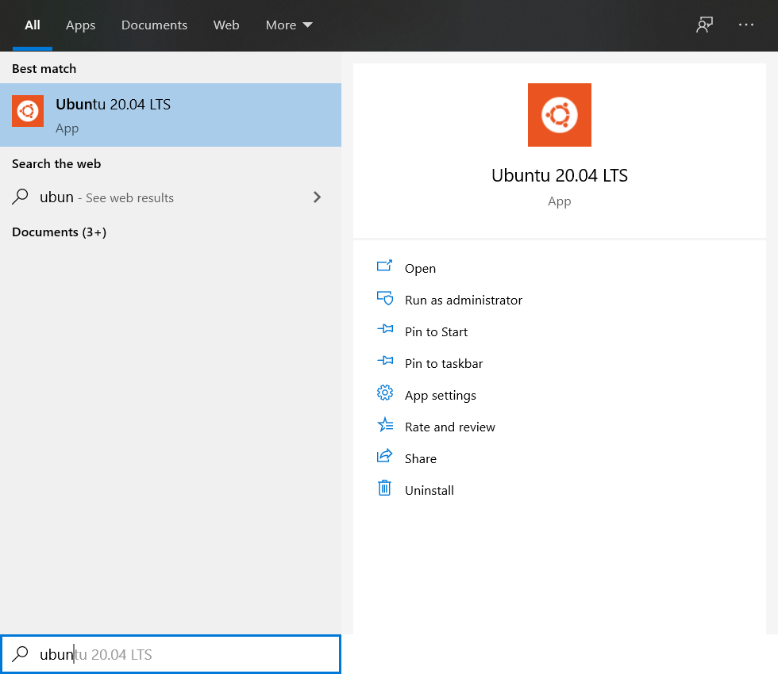</p>

Thêm tính năng copy và paste và Ubuntu:

<p align="center">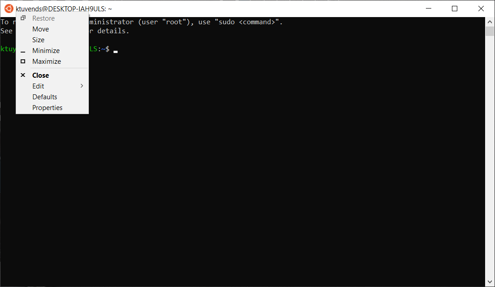</p>

<p align="center">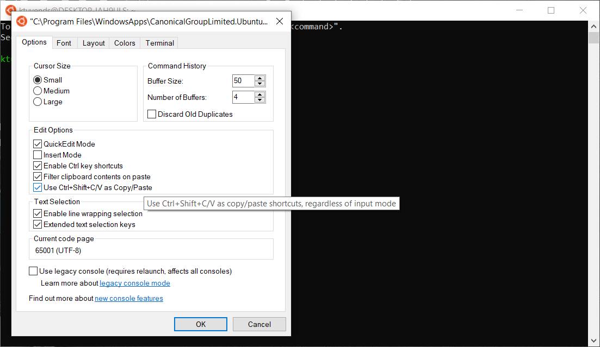</p>

Như vậy là giờ ta có thể sử dụng tổ hợp `Ctrl + Shift + C/V` để copy hoặc paste rồi.

Bước cuối cùng, cấu hình cho Ubuntu sử dụng WSL 2:

Vẫn như ở trên, các bạn bật Powershell và chạy các lệnh dưới đây:

```bash
# Liệt kê danh sách các app linux
wsl --list --verbose
```

```bash
# <distribution name>: Tên của app linux, ví dụ Ubuntu-20.04
# <versionNumber>: Version của WSL, ở đây mình chọn 2
wsl --set-version <distribution name> <versionNumber>
```

Đến đây về cơ bản là chúng ta đã cài xong WSL2 trên Windows rồi đó. Trong các phần tiếp theo, chúng ta sẽ làm quen với một số thao tác cơ bản trên WSL2.

### 1.4. Di chuyển Linux Disk Image

Theo mặc định, Linux/Ubuntu được cài đặt ở ổ `C:`, nhưng đôi khi ổ `C:` không đủ dung lượng, các bạn có thể làm theo các bước dưới đây để di chuyển nó qua một ổ đĩa khác. Ở đây mình ví dụ là ổ `D:`

Chúng ta tiếp tục với Powershell:

```bash
# Xem danh sách các bản linux được cài đặt:
wsl --list

# Tạo một file backup .tar trong D:\backup
mkdir D:\backup
wsl --export Ubuntu-20.04 D:\backup\ubuntu.tar

# Xóa nó khỏi ổ C:
wsl --unregister Ubuntu-20.04

# Import vào ổ D:
mkdir D:\wsl
wsl --import Ubuntu-20.04 D:\wsl\ D:\backup\ubuntu.tar

# Xem lại danh sách các bản linux
wsl --list
```

Như vậy là hoàn tất và các bạn có thể xóa file backup ở trong `D:\backup`. Tuy nhiên, còn một vấn đề là Ubuntu bây giờ sẽ sử dụng tài khoản `root` làm tài khoản mặc định và ta cần thay đổi lại nó trong ubuntu:

```bash
# <yourname> là tên bạn khởi tạo khi cài đặt ubuntu
ubuntu config --default-user <yourname>
```

### 1.5. Truy cập các files Linux từ Windows

Đầu tiên, Ubuntu phải được bật. Sau đó, các bạn vào File Explorer hoặc My Computer. Nhập `\\wsl$\` vào ô địa chỉ. Kết quả như sau:

<p align="center">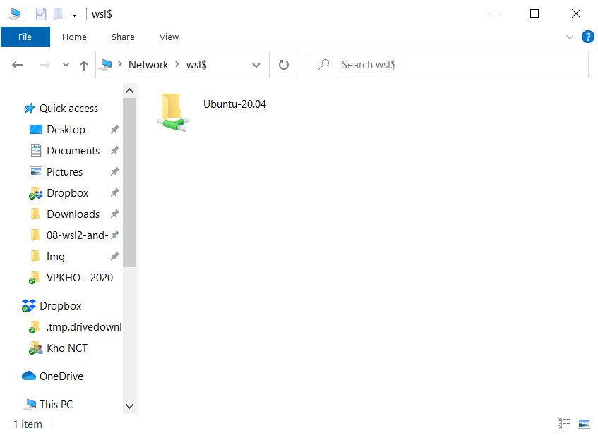</p>

Các files cá nhân cơ bản sẽ được lưu trữ ở địa chỉ: 

```bash
\\wsl$\Ubuntu-20.04\home\<username>
```

Để thuận tiện cho việc sử dụng, các bạn có thể tạo một ổ đĩa ảo cho Ubuntu bằng cách sau: Vào địa chỉ `\\wsl$\`, chuột phải vào phiên bản Ubuntu muốn tạo ổ đĩa và chọn **Map network drive**:

<p align="center">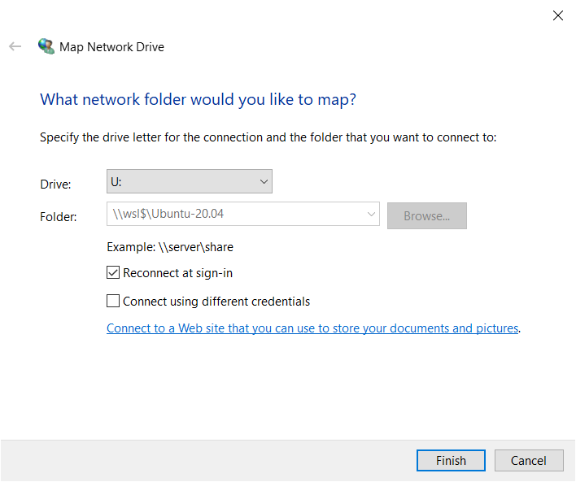</p>

### 1.6. Truy cập các files Windows từ Linux

Linux sử dụng một thư mục có tên là `/mnt/`. Và ta hiểu đơn giản, thư mục này giống như My Computer ý. Trong đó, sẽ gồm các ổ đĩa như `C:, D:,...`

<p align="center">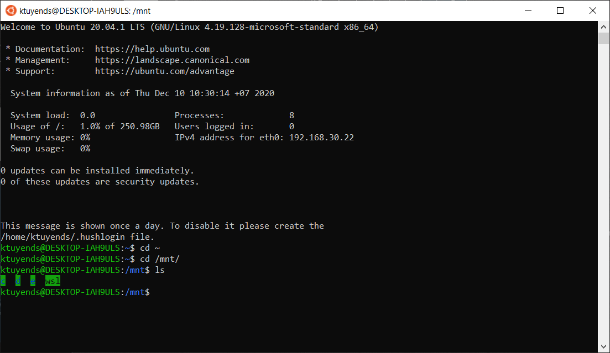</p>

### 1.7. Chạy các lệnh Linux từ Windows

Mọi lệnh Linux (Bash) đều có thể được chạy từ Powershell hoặc Terminal sử dụng:

```bash
wsl <linux-command>
```

### 1.8. Chạy các ứng dụng Windows từ Linux

Hầu hết các ứng dụng trong Windows có thể khởi chạy trong Linux, thường thường yêu cầu có phần mở rộng là `.exe`. Ví dụ mở File Explorer:

```bash
# Mở file explorer
explorer.exe
```

## 2. Cài đặt RStudio Server trong WSL2

Trong phần này, các lệnh sẽ chạy trực tiếp trong Ubuntu bởi vì chúng ta đang cài trong Ubuntu. Tuy nhiên, trước tiên ta cần update Ubuntu với các lệnh sau:

```bash
sudo apt update -y
sudo apt upgrade -y
```

### 2.1. Cài đặt R

Để cài đặt R, các bạn chạy lần lượt các lệnh dưới đây:

```bash
sudo apt-key adv --keyserver keyserver.ubuntu.com --recv-keys E298A3A825C0D65DFD57CBB651716619E084DAB9

sudo add-apt-repository 'deb https://cloud.r-project.org/bin/linux/ubuntu focal-cran40/'

sudo apt update

sudo apt install -y r-base r-base-core r-recommended r-base-dev gdebi-core build-essential libcurl4-gnutls-dev libxml2-dev libssl-dev
```

Sau khi cài đặt xong, hãy chạy lệnh `R --version` để kiểm tra:

<p align="center">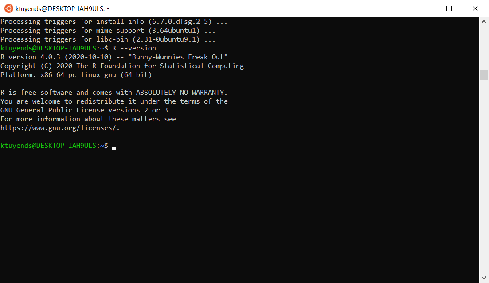</p>

### 2.2. Cài đặt RStudio Server

Để cài đặt RStudio Server, chúng ta sử dụng 2 lệnh sau:

```bash
wget https://rstudio.org/download/latest/stable/server/bionic/rstudio-server-latest-amd64.deb

sudo gdebi rstudio-server-latest-amd64.deb
```

Sau đó, để bắt đầu với RStudio: 

```bash
sudo rstudio-server start
```

Để vào RStudio, các bạn bật trình duyệt web và truy cập vào địa chỉ sau: `http://localhost:8787/`. Các bạn đăng nhập bằng tài khoản và password lúc cài đặt Ubuntu nha.

<p align="center">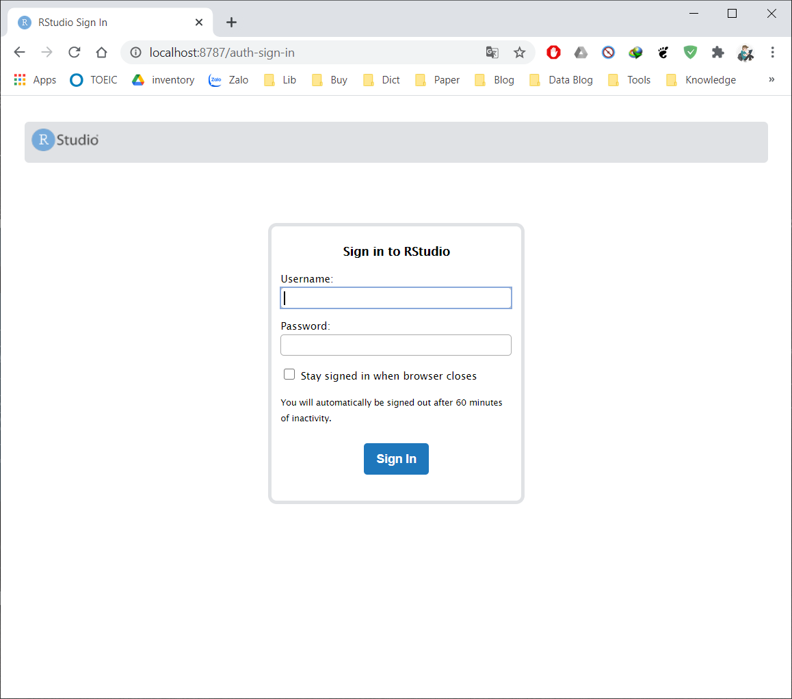</p>

<p align="center">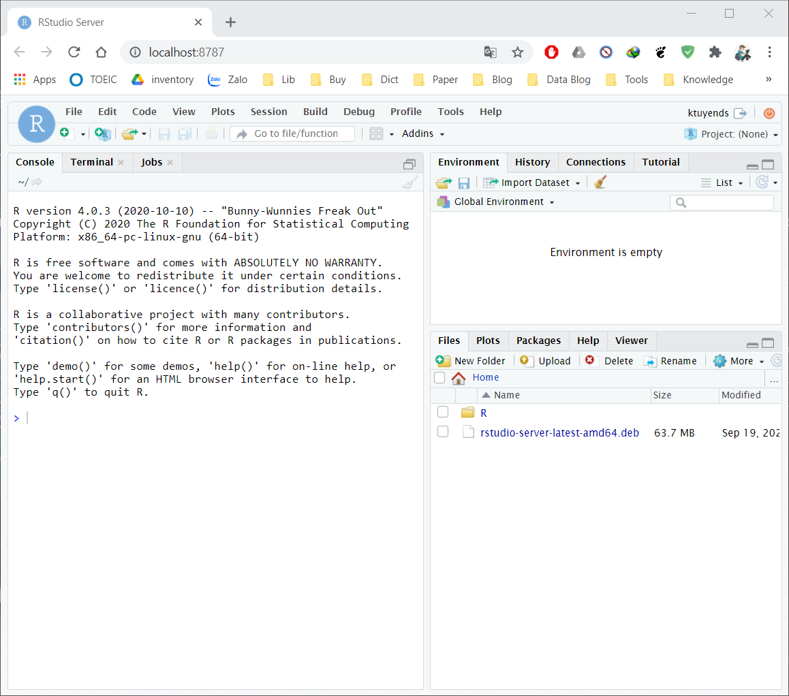</p>

Cuối cùng, khi không muốn sử dụng nữa, hãy thoát RStudio với lệnh:

```bash
sudo rstudio-server stop
```

## 3. Tham khảo

* [Windows Subsystem for Linux Installation Guide for Windows 10](https://docs.microsoft.com/en-us/windows/wsl/install-win10)
* [Windows Subsystem for Linux 2: The Complete Guide](https://www.sitepoint.com/wsl2/)
* [Using RStudio Server in Windows WSL2
](https://support.rstudio.com/hc/en-us/articles/360049776974-Using-RStudio-Server-in-Windows-WSL2)
