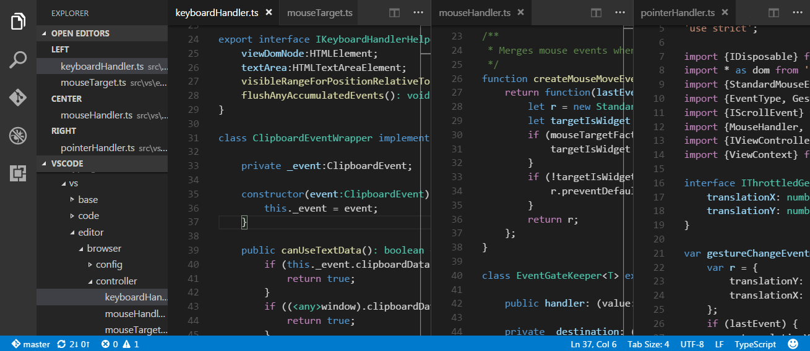

Khi bắt đầu học lập trình, có lẽ bạn sẽ phải lựa chọn giữa việc sử dụng Text Editor hay IDE để làm môi trường lập trình của mình. Lựa chọn cái nào thì tùy thuộc vào sở thích cá nhân của mỗi người. Còn nếu bạn không biết lựa chọn cái nào, thì Visual Studio Code (VS Code) rất đáng để thử.

VS Code là một text editor mã nguồn mở được phát triển bởi Microsoft, chạy được trên nhiều hệ điều hành. Tuy chỉ là một text editor, nhưng nó có rất nhiều extensions giúp chúng ta thêm vào các tính năng không thua kém gì một IDE. Để bắt đầu, các bạn vào trang: [Visual Studio Code](https://code.visualstudio.com/), tải về phiên bản tương ứng với hệ điều hành và cài đặt nó.

## 1. Visual Studio Code

### 1.1. Cài đặt một số extensions linh tinh

- Theme [One Dark Pro](https://marketplace.visualstudio.com/items?itemName=zhuangtongfa.Material-theme) hoặc [Material](https://marketplace.visualstudio.com/items?itemName=Equinusocio.vsc-material-theme)
- Bộ icon của [Material](https://marketplace.visualstudio.com/items?itemName=PKief.material-icon-theme) hoặc [VSCode Icons](https://marketplace.visualstudio.com/items?itemName=vscode-icons-team.vscode-icons)
- Font [Fira Code](https://github.com/tonsky/FiraCode) và setup Ligatures
- [Bracket Pair Colorizer 2](https://marketplace.visualstudio.com/items?itemName=CoenraadS.bracket-pair-colorizer-2)
- [Prettier - Code formatter](https://marketplace.visualstudio.com/items?itemName=esbenp.prettier-vscode)
- [Better Comments](https://marketplace.visualstudio.com/items?itemName=aaron-bond.better-comments)
- [Path Intellisense](https://marketplace.visualstudio.com/items?itemName=christian-kohler.path-intellisense)

### 1.2. Làm quen với VS Code


Trong bài này, tôi sẽ không hướng dẫn cách sử dụng VS Code mà chỉ ghi chép lại một vài thứ linh tinh mà tôi cũng không biết phải gọi là gì nữa. Để bắt đầu với VS Code, các bạn có thể xem phần [DOCS](https://code.visualstudio.com/docs), tôi thấy nó khá là dễ hiểu và trực quan.    


**Một số phím tắt hay dùng nhất**

|||
|-|-|
|Ctrl + P| Tìm kiếm nhanh các files hoặc icons dựa vào tên|
|Ctrl + Shift + P| Mở Command Palette|
|Ctrl + Tab| Di chuyển giữa các file đang mở|
|Ctrl +B| Đóng mở thanh side bar|
|Ctrl + `| Mở Terminal|
|Ctrl + K M| Thay đổi language mode|
|Ctrl + G| Đi đến một dòng cụ thể|
|Ctrl + /| Comment|

**Split Editor:**

Chúng ta có thể chia màn hình soạn thảo của VS Code thành nhiều ô, mỗi ô mở tương ứng một file, giống như hình bên dưới:

<p align="center"></p>

<p align="center"></p>

Có nhiều cách để thực hiện điều này:

- Cách 1: `View --> Editor Layout` và chọn layout tương ứng
- Cách 2: Sử dụng nút Split Editor ở phía trên vùng minimap
- Cách 3: Sử dụng phím tắt `Ctrl + \`
- Cách 4: Sử dụng phím tắt: `Alt + Click` vào files
- Cách 4: Kéo thả files

Chúng ta sử dụng phím tắt: `Ctrl + 1, 2, 3` để di chuyển giữa các vùng.

**Các phím tắt chỉnh sửa code:**

|||
|----|-|
|Alt + Click| Thêm một con trỏ vào vị trí chỉ định|
|Ctrl + Alt + &#8593;| Thêm con trỏ vào vị trí phía trên con trỏ hiện tại|
|Ctrl + Alt + &#8595;| Thêm con trỏ vào vị trí phía dưới con trỏ hiện tại|
|Ctrl + L| Bôi đen toàn bộ dòng hiện tại|
|Ctrl + D| Chọn các từ hoặc cụm từ tiếp theo, giống từ hoặc cụm từ hiện tại và thêm con trỏ phía sau nó|
|Ctrl + Shift + L| Tương tự Ctrl + D, nhưng nó chọn tất cả các từ hoặc cụm từ giống nhau|
|Shift + Alt + Click| Column selection|
|Shift + Alt + &#8593;| Copy line up|
|Shift + Alt + &#8595;| Copy line down|
|Alt + Up/Down| Move line up and down|

## 2. Lập trình R trong VS Code

**Bước 1: Cài đặt R và các extensions sau** 

- [R](https://www.r-project.org/)
- [vscode-R](https://marketplace.visualstudio.com/items?itemName=Ikuyadeu.r)

**Bước 2: Cài đặt packages sau trong R**

```r
# Cài đặt package languageserver
install.packages("languageserver")

# Cài đặt thông qua Github
remotes::install_github("REditorSupport/languageserver")
```

**Bước 3: Cài đặt Radian**

Radian là một R console với nhiều tính năng hơn R console mặc định. Nó được viết bằng Python nên ta có thể cài đặt nó thông qua pip:

```python
# install released version
pip install -U radian
```

**Bước 4: Chỉnh sửa file cấu hình**

Sử dụng tổ hợp phím: Ctrl + Shift + P và tìm cụm từ: *preferences: Open Settings (JSON)*, sau đó thêm nội dung sau vào file `settings.json`:

```
{
    "r.alwaysUseActiveTerminal": true,
    "r.bracketedPaste": true,
    "r.sessionWatcher": true,
    "r.rterm.windows": "Path_to_radian.exe", 
}
```

Cuối cùng thì, khởi động lại VS Code và tận hưởng thành quả thôi nào!

<p align="center"><a href="https://github.com/Ikuyadeu/vscode-R/wiki/R-Session-watcher"></a></p>

## 3. SQL Server trong VS Code

**Bước 1: Cài đặt extension `mssql` và SQL Server Developer**

- [SQL Server](https://www.microsoft.com/en-us/sql-server/sql-server-downloads)
- [SQL Server Management Studio](https://docs.microsoft.com/en-us/sql/ssms/download-sql-server-management-studio-ssms?view=sql-server-ver15)
- [mssql](https://marketplace.visualstudio.com/items?itemName=ms-mssql.mssql)

**Bước 2: Kết nối với Database trong SQL Server** 

Sau khi cài xong extension `mssql`, ta sẽ được kết quả như hình bên dưới. Tiếp theo ta chọn vào `Add Connection` để kết nối VS Code với SQL Server. 

<p align="center"></p>

Trong cửa sổ mới xuất hiện, ta nhập `Server name`, sau đó nhập một số thông tin khác như user name, password,...

<p align="center"></p>

Cuối cùng thì nhập Profile name (hiểu đơn giản là đặt tên cho kết nối này) để kết thúc. Và đây là thành quả:

<p align="center"></p>

**Bước 3: Viết các câu lệnh truy vấn và xem kết quả**

Để thực hiện truy vấn, các bạn click chuột phải vào database và chọn *New Query* hoặc chọn từ Command Palette `(Ctrl + Shift + P)` - *MS SQL: New Query*. Sau đó thì ta có thể viết các câu lệnh, run để xem kết quả và lưu kết quả dưới một trong ba định dạng CSV, JSON, hoặc EXCEL.

<p align="center"></p>

## 4. Lập trình Python trong VS Code

Đầu tiên, chúng ta cần phải cài đặt [Python](https://marketplace.visualstudio.com/items?itemName=ms-python.python) extension, sau đó đọc hướng dẫn sau: [Python tutorial](https://code.visualstudio.com/docs/python/python-tutorial). Trang này hướng dẫn khá chi tiết về cách sử dụng Python trong VS Code.

## 5. Tham khảo

- [Visual Studio Code](https://code.visualstudio.com/docs)
- [Writing R in VSCode: A Fresh Start](https://renkun.me/2019/12/11/writing-r-in-vscode-a-fresh-start/)
- [Writing R in VSCode: Interacting with an R session](https://renkun.me/2019/12/26/writing-r-in-vscode-interacting-with-an-r-session/)
- [Writing R in VSCode: Working with multiple R sessions](https://renkun.me/2020/04/14/writing-r-in-vscode-working-with-multiple-r-sessions/)
- [Visual Studio Code for Python Programmers](https://learning.oreilly.com/library/view/visual-studio-code/9781119773368/)
