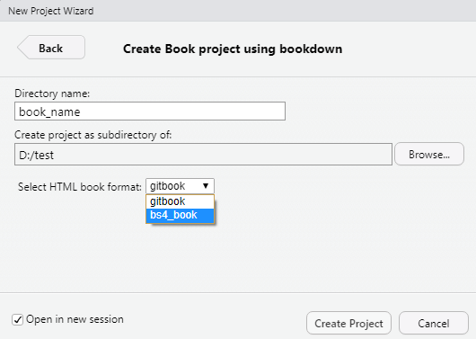
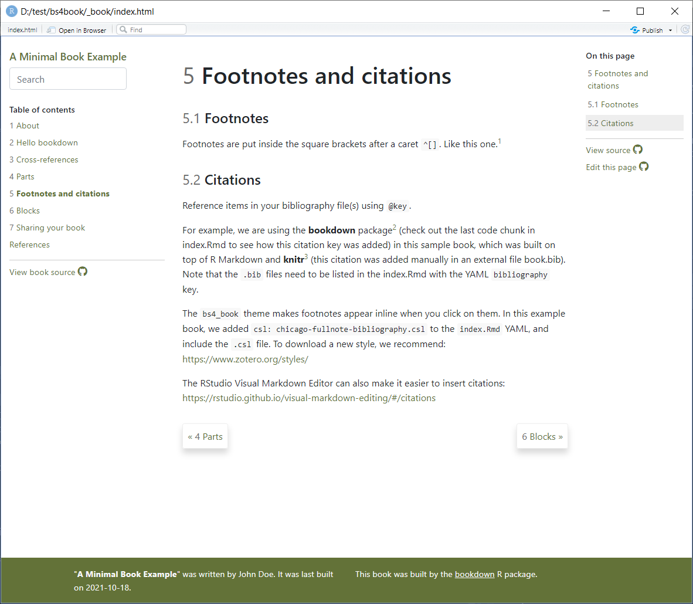
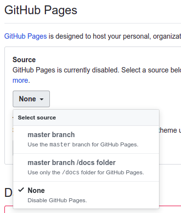

Đọc nhiều sách, có bao giờ bạn nghĩ sẽ có một ngày mình muốn viết một quyển sách của riêng mình chưa. Đã rất nhiều lần, mình từng có ý nghĩ như vậy. Viết một quyển sách với mình, đôi khi chỉ đơn giản là để tóm tắt lại nội dung từ một hoặc nhiều sách khác vào một quyển để tiện cho việc tra cứu mỗi khi bản thân cần đọc lại.

Bài viết này cũng như vậy, mình tóm tắt lại một số nội dung trong quyển sách _bookdown: Authoring Books and Technical Documents with R Markdown_ của ([Xie 2016](#ref-bookdown2016)).

## 1. Cú pháp Markdown

### 1.1. Markdown cơ bản

#### Inline formatting

- In nghiêng: `*text*`

- In đậm: `**text**`

- Chỉ số trên: `^n^` - ví dụ: Fe<sup>2+</sup>

- Chỉ số dưới: `~n~` - ví dụ: H<sub>2</sub>SO<sub>4</sub>

- Inline code: `` `code` ``

- Links: `[Text](link)`

- Image: ``

- Footnote: `^[]`. Ví dụ [^1]

#### Block-level elements

Tiêu đề:

```markdown
# First-level header

## Second-level header

### Third-level header
```

Thêm `{-}` vào phần sau của tiêu đề không muốn đánh số. Ví dụ:

```
# Preface {-}
```

List:

```markdown
# Unordered list

- one item
- one item
- one item
  - one item
  - one item
```

```markdown
# Ordered list

1. the first item
2. the second item
3. the third item
```

Blockquotes:

```markdown
> "I thoroughly disapprove of duels. If a man should challenge me,
> I would take him kindly and forgivingly by the hand and lead him
> to a quiet place and kill him."
>
> --- Mark Twain
```

Kết quả:

> “I thoroughly disapprove of duels. If a man should challenge me, I would take him kindly and forgivingly by the hand and lead him to a quiet place and kill him.”
>
> — Mark Twain

#### Công thức toán học

Có 2 trường hợp:

- Chèn công thức bên trong câu: `$math_express$`
- Chèn công thức ở một dòng riêng biệt: `$$math_express$$`

Ví dụ:

Inline: \$f(k) = {n \\choose k} p^{k} (1-p)^{n-k}\$. Ngược lại:

\$$X = \begin{bmatrix}1 & x_{1}\\\\ 1 & x_{2}\\\\ 1 & x_{3} \end{bmatrix}$\$

### 1.2. Markdown nâng cao

Mặc dù markdown cơ bản hỗ trợ kha khá công việc soạn thảo của chúng ta, nhưng đôi khi vẫn chưa đủ. Ví dụ như chưa có đánh số các biểu thức toán học, chưa hỗ trợ trích dẫn tài liệu tham khảo,…Vì vậy, chúng ta cần sử dụng `bookdown` để giải quyết các vấn đề này.

#### Đánh số các biểu thức toán học

Để đánh số một biểu thức, sử dụng cú pháp sau ở phía sau biểu thức: `(\#eq:label)`

Để tham chiếu đến biểu thức: `\@ref(eq:label)`

Ví dụ:

```latex
\begin{equation}
  f\left(k\right) = \binom{n}{k} p^k\left(1-p\right)^{n-k}
  (\#eq:binom)
\end{equation}
```

#### Tiêu đề đặc biệt

Tiêu đề `PART` có thể hiểu đơn giản là để tách nội dung của quyển sách thành các phần riêng biệt. Còn `APPENDIX` là phần phụ lục.

```markdown
# (PART) Part I {-}

# Chapter One

# Chapter Two

# (PART) Part II {-}

# Chapter Three

# (APPENDIX) Appendix {-}

# Appendix A

# Appendix B
```

### 1.3. Code Chunks

Để chèn code vào bài viết, ta sử dụng code chunks với cú pháp:

````markdown
```{r, options}
# code here
```
````

Một số ngôn ngữ cơ bản được hỗ trợ như R, SQL, Python,…

Một số tùy chọn:

- `include`: Có hiển thị code và kết quả không
- `eval`: Có thực thi code hay không
- `echo`: Có hiển thị code hay không
- `results`: Có hiển thị output hay không
- `collapse`: Có merge code hay không
- `cache`
- `fig.width, fig.height, fig.align, fig.cap`
- `out.width, out.height`

### 1.4. Citations

Để sử dụng trích dẫn tài liệu tham khảo trong bài viết, ta cần có file `.bib` chứa thông tin về các tài liệu tham khảo. Sau đó ta cần chỉnh sửa YAML trong tài liệu R Markdown hoặc trong phần output của bookdown

```markdown
---
bibliography: ["file_1.bib", "file_2.bib"]
biblio-style: "apalike"
link-citations: true
---
```

Để trích dẫn ta sử dụng cú pháp: `@key` hoặc `[@key]`

## 2. Các bước viết một quyển sách

### 2.1. Tạo một quyển sách định dạng HTML

Trước tiên, ta cần cài đặt `bookdown`:

```r
# stable version on CRAN
install.packages("bookdown")

# or development version on GitHub
remotes::install_github('rstudio/bookdown')
```

Để build được sách ở định dạng Bootstrap, ta cần cài đặt thêm package `downlit`

```r
# Cài đặt package downlit
install.packages("downlit")
```

Sau đó, chúng ta sử dụng RStudio: `File > New Project > New Directory > Book project using bookdown`

<p></p>

Khi đó, một quyển sách đơn giản được tạo ra bởi RStudio. Để xem kết quả, ta chọn `build -> build book`:

<p></p>

### 2.2. Cấu trúc của một quyển sách sử dụng `bookdown`

Một quyển sách được tạo ra bởi `bookdown` sẽ gồm nhiều files:

- `index.Rmd` là file bắt buộc phải có
- `_bookdown.yml` và `_output.yml` là các file tùy chỉnh cấu trúc sách
- `style.css` định dạng các thành phần ở định dạng HTML
- `.bib` chứa thông tin về tài liệu tham khảo
- Các file `.Rmd` còn lại là nội dung của từng chương

Tùy chỉnh YAML trong file `index.Rmd`, thay đổi một số thông tin về tên quyển sách, tác giả của quyển sách,…:

```markdown
---
title: "A Minimal Book Example"
author: "Jane Doe"
date: "2021-10-13"
site: bookdown::bookdown_site
output: bookdown::bs4_book
url: https://bookdown.org/janedoe/bookdown-demo
cover-image: cover.png
description: |
  This is a minimal example of using the bookdown package to write a book.
  The output format for this example is bookdown::bs4_book.
bibliography: ["book.bib", "packages.bib"]
biblio-style: apalike
link-citations: yes
csl: chicago-fullnote-bibliography.csl
---
```

Tùy chỉnh file `_output.yml`, thay đổi thông tin về font, màu sắc, repository lưu trữ quyển sách…:

```yml
bookdown::bs4_book:
  css: style.css
  theme:
    primary: "#0d6efd"
    base_font:
      google: Sen
    heading_font:
      google:
        family: Bitter
        wght: 200
    code_font:
      google:
        # arguments to sass::font_google()
        family: DM Mono
        local: false
  repo:
    base: https://github.com/hadley/ggplot2-book
    branch: main
    subdir: book
    icon: "fas fa-air-freshener"
```

Cấu trúc của một chương sách:

```markdown
# A chapter

## A section

### A subsection
```

Mỗi chương nằm trong một file, được bắt đầu bởi tiêu đề (header 1), sau đó là các nội dung.

Tùy chỉnh file `_bookdown.yml`, sắp xếp thứ tự các chương sách:

```yml
book_filename: "test"
new_session: true
before_chapter_script: _common.R
delete_merged_file: true
language:
  ui:
    chapter_name: "Chapter "
rmd_files: ["index.Rmd", "chapter_1.Rmd", "chapter_2.Rmd"]
```

### 2.3. Hosting bookdown using Github Pages

Đầu tiên, ta cần sửa file `_bookdown.yml` bằng cách thêm dòng sau:

```yml
output_dir: "docs"
```

Sau đó, push quyển sách của chúng ta lên GitHub, vào phần cài đặt của Repository chứa quyển sách thay đổi `Source` thành: `master branch /docs folder`:

<p></p>

Khi đó quyển sách của chúng ta sẽ có địa chỉ là: `http(s)://<username>.github.io/<projectname>`

## 3. Tham khảo

<div id="refs" class="references csl-bib-body hanging-indent">

<div id="ref-bookdown2016" class="csl-entry">

Xie, Yihui. 2016. _Bookdown: Authoring Books and Technical Documents with R Markdown_. Boca Raton, Florida: Chapman; Hall/CRC. <https://bookdown.org/yihui/bookdown>.

</div>

</div>

[^1]: Đây là một footnote
