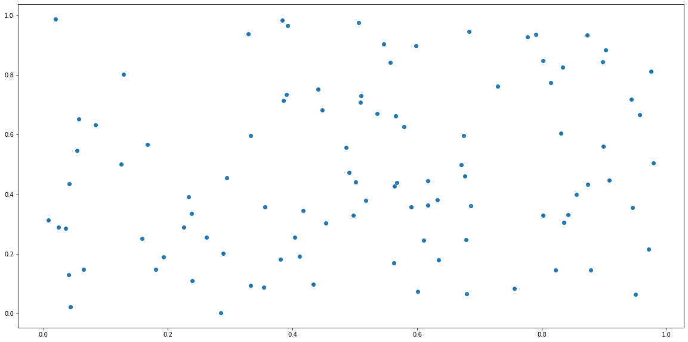

<!--more-->

## 1. Khởi động chương trình

Để bắt đầu với ipython, ta sử dụng command line:

```bash
ipython
```

Để bắt đầu với Jupyter notebook sử dụng command line:

```bash
jupyter notebook
```

## 2. Tab Completion

Chúng ta có thể sử dụng phím Tab sau các từ hoặc cụm từ để xem các gợi ý bên trong ipython. 

Ipython không chỉ đưa ra các gợi ý về mặt cú pháp, mà còn có thể đưa ra các gợi ý về đường dẫn tên files.

## 3. Sử dụng trợ giúp

Sử dụng (`?`) hoặc (`??`) trước hoặc sau một đối tượng, để xem một số thông tin về đối tượng đó. Ví dụ:

```python
In [1]: b = [1, 2, 3]

In [2]: b?
```

```
Type:        list
String form: [1, 2, 3]
Length:      3
Docstring:
Built-in mutable sequence.

If no argument is given, the constructor creates a new empty list.
The argument must be an iterable if specified.
```

## 4. Command *%run* và *%load*

Chúng ta có thể chạy các file python trong ipython sử dụng command `%run`

```python
In [3]: %run file_name.py
```

Nếu bạn không muốn chạy file mà chỉ muốn thêm nội dung trong file vào ipython, sử dụng `%load`

> Trong nhiều trường hợp, nếu đoạn mã gặp lỗi và bạn muốn thoát khỏi trạng thái chạy, có thể sử dụng phím tắt `Ctrl + C`

## 5. Command line trong Ipython

Thực thi command line trong ipython bằng cách thêm `!` phía trước command line, ví dụ:

```
!pip install pandas
```

## 6. Command *%%time*

Xem thời gian tính toán một cell sử dụng `%%time:


```python
%%time
for i in range(10000):
    a = i**2
```

    Wall time: 4 ms
    

## 7. Command *%matplotlib*

Sử dụng `%matplotlib inline` khi vẽ hình:


```python
%matplotlib inline
from matplotlib import pyplot as plt
import numpy as np
x = np.random.rand(100)
y = np.random.rand(100)
plt.rcParams["figure.figsize"] = (20, 10)
plt.scatter(x, y);
```


    

    


## 8. Một số magic command khác

Danh sách các magic command trong ipython:


```python
%lsmagic
```


    Available line magics:
    %alias  %alias_magic  %autoawait  %autocall  %automagic  %autosave  %bookmark  %cd  %clear  %cls  %colors  %conda  %config  %connect_info  %copy  %ddir  %debug  %dhist  %dirs  %doctest_mode  %echo  %ed  %edit  %env  %gui  %hist  %history  %killbgscripts  %ldir  %less  %load  %load_ext  %loadpy  %logoff  %logon  %logstart  %logstate  %logstop  %ls  %lsmagic  %macro  %magic  %matplotlib  %mkdir  %more  %notebook  %page  %pastebin  %pdb  %pdef  %pdoc  %pfile  %pinfo  %pinfo2  %pip  %popd  %pprint  %precision  %prun  %psearch  %psource  %pushd  %pwd  %pycat  %pylab  %qtconsole  %quickref  %recall  %rehashx  %reload_ext  %ren  %rep  %rerun  %reset  %reset_selective  %rmdir  %run  %save  %sc  %set_env  %store  %sx  %system  %tb  %time  %timeit  %unalias  %unload_ext  %who  %who_ls  %whos  %xdel  %xmode
    
    Available cell magics:
    %%!  %%HTML  %%SVG  %%bash  %%capture  %%cmd  %%debug  %%file  %%html  %%javascript  %%js  %%latex  %%markdown  %%perl  %%prun  %%pypy  %%python  %%python2  %%python3  %%ruby  %%script  %%sh  %%svg  %%sx  %%system  %%time  %%timeit  %%writefile
    
    Automagic is ON, % prefix IS NOT needed for line magics.


## 9. Convert ipython sang markdown

```python
jupyter nbconvert file_name.ipynb --to markdown --NbConvertApp.output_files_dir=.
```
