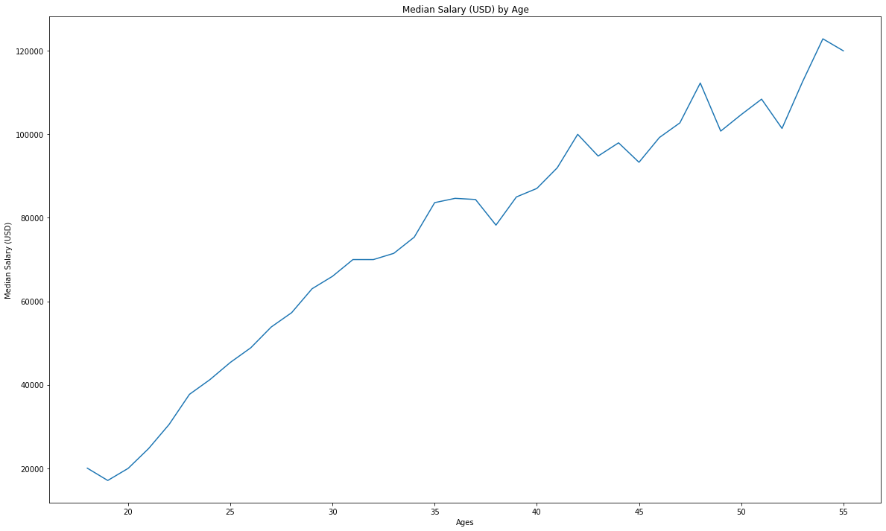
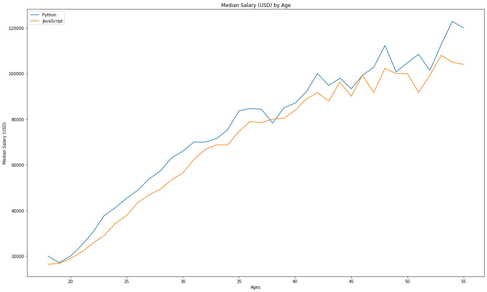
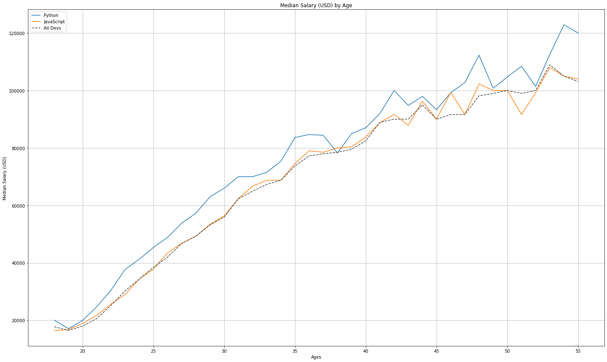
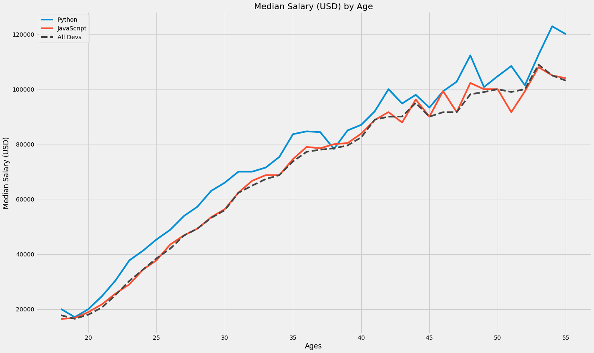
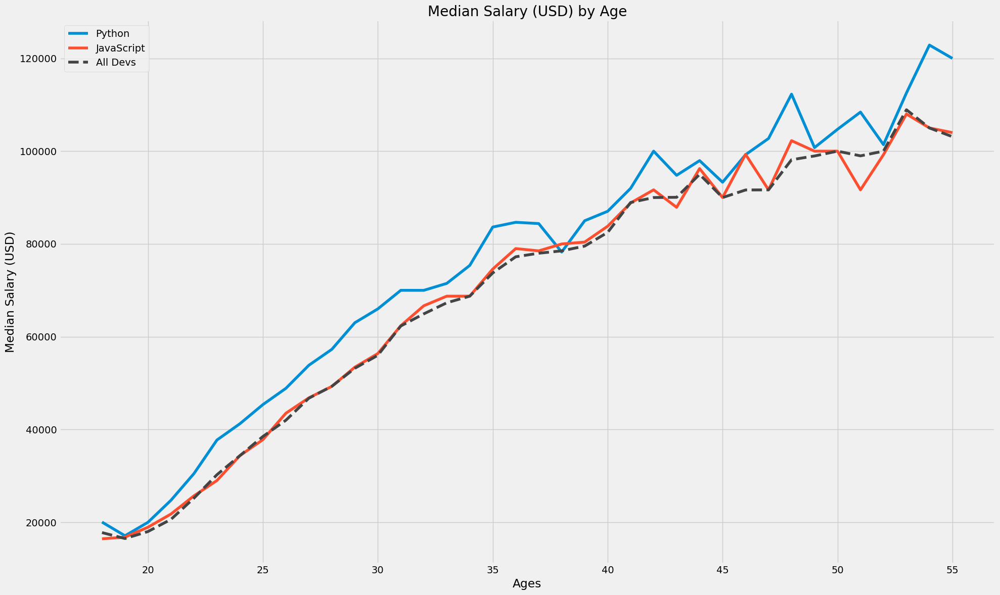
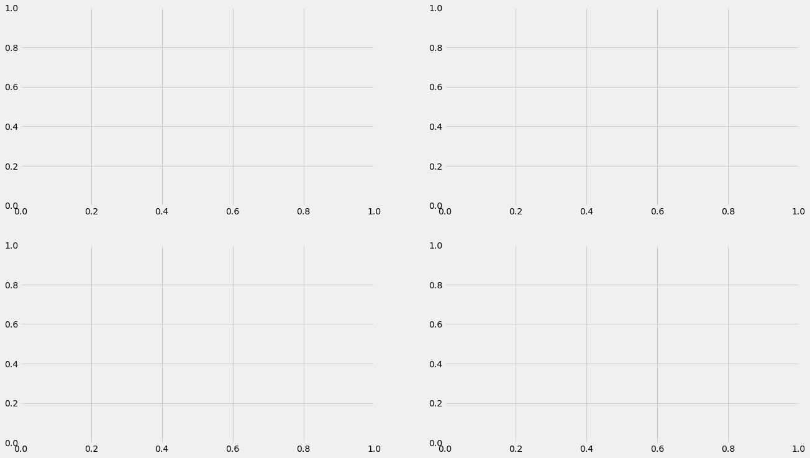
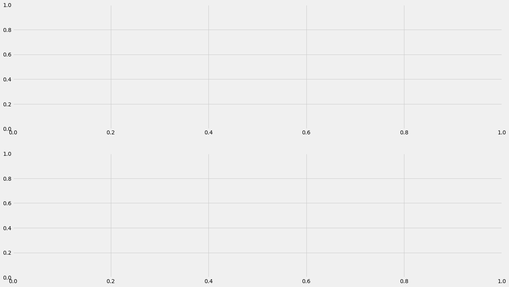
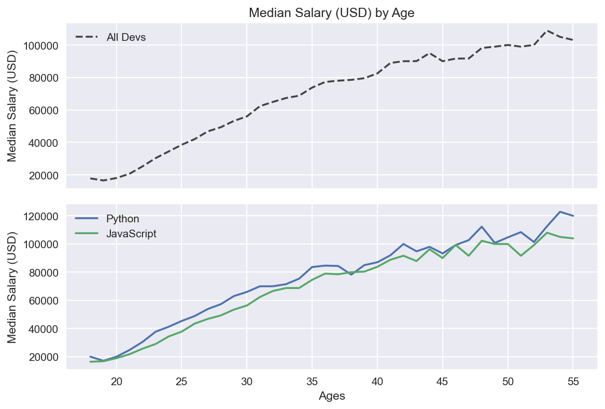
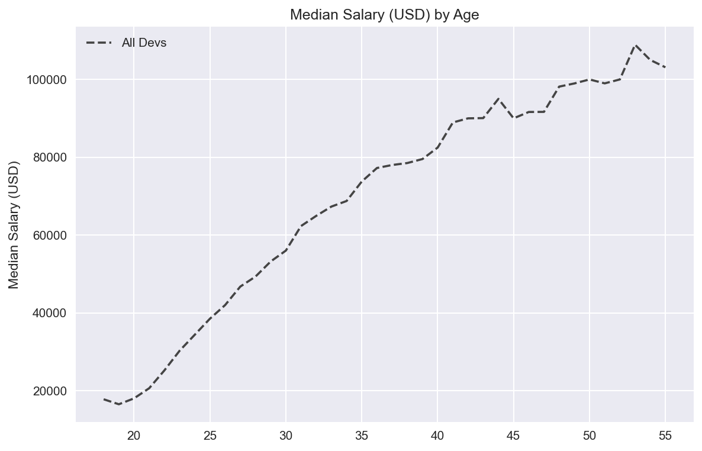
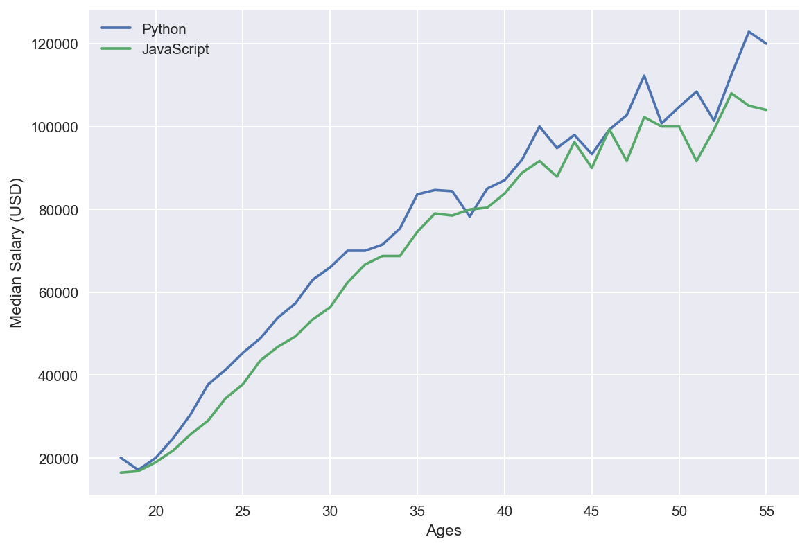

<!--more-->
Trong hai bài trước, chúng ta đã đi tìm hiểu về Numpy và Pandas. Đây là hai thư viện thường xuyên được sử dụng trong phân tích dữ liệu để xử lý, biến đổi và làm sạch dữ liệu. Trong bài này, chúng ta đi sẽ tìm hiểu thêm một thư viện nữa, cũng là bài cuối cùng trong Series này, đó là Matplotlib, thư viện được sử dụng trong việc vẽ các đồ thị và visualizations.

Trước khi đi vào thực hành, chúng ta cần cài đặt thư viện:

```python
# Cài đặt bằng pip
pip install matplotlib

# Cài đặt bằng conda
conda install matplotlib
```


```python
# Import các thư viện
import numpy as np
import pandas as pd
import matplotlib.pyplot as plt

# Tùy chỉnh size của đồ thị được tạo ra
plt.rcParams["figure.figsize"] = (20, 12)
```

## 1. Anatomy of a plot



Các plots trong matplotlib có cấu trúc phân cấp theo thứ tự từ _Figure -> Axes -> Plots_. Hiểu đơn giản, đối tượng Figure là một container sẽ chứa nhiều đối tượng Axes được sắp xếp theo hàng hoặc cột. Sau đó với mỗi đối tượng Axes chúng ta có thể vẽ một hoặc nhiều plots trong đấy.



Với mỗi Plots trong Axes, chúng ta sẽ có các thành phần sau:

- **Spines**: Là một đường thẳng kết nối các stick ở trên một trục với nhau.
- **Title**: Tiêu đề của figure.
- **Legend**: Chú thích của các plots.
- **Grid**: Đường lưới bên trong một plot.
- **X/Y axis label**: Tiêu đề của từng trục.
- **Minor tick**: Các stick nhỏ (phụ) trên một trục.
- **Minor tick label**: Labels của các minor stick.
- **Major tick**: Các stick lớn (chính) trên một trục.
- **Major tick label**: Labels của các major stick.
- **Line**: Kiểu biểu đồ kết nối các điểm dữ liệu với nhau.
- **Markers**: Các điểm dữ liệu


## 2. First plots

Giả sử chúng ta có những dữ liệu sau:


```python
ages_x = [18, 19, 20, 21, 22, 23, 24, 25, 26, 27, 28, 29, 30, 31, 32, 33, 34, 35,
          36, 37, 38, 39, 40, 41, 42, 43, 44, 45, 46, 47, 48, 49, 50, 51, 52, 53, 54, 55]

py_dev_y = [20046, 17100, 20000, 24744, 30500, 37732, 41247, 45372, 48876, 53850, 57287, 63016, 65998, 70003, 70000, 71496, 75370, 83640, 84666, 84392, 78254, 85000, 87038, 91991, 100000, 94796, 97962, 93302, 99240, 102736, 112285, 100771, 104708, 108423, 101407, 112542, 122870, 120000]

js_dev_y = [16446, 16791, 18942, 21780, 25704, 29000, 34372, 37810, 43515, 46823, 49293, 53437, 56373, 62375, 66674, 68745, 68746, 74583, 79000, 78508, 79996, 80403, 83820, 88833, 91660, 87892, 96243, 90000, 99313, 91660, 102264, 100000, 100000, 91660, 99240, 108000, 105000, 104000]

dev_y = [17784, 16500, 18012, 20628, 25206, 30252, 34368, 38496, 42000, 46752, 49320, 53200, 56000, 62316, 64928, 67317, 68748, 73752, 77232, 78000, 78508, 79536, 82488, 88935, 90000, 90056, 95000, 90000, 91633, 91660, 98150, 98964, 100000, 98988, 100000, 108923, 105000, 103117]
```

Chúng ta sẽ bắt đầu với một đồ thị đơn giản sử dụng hàm `plt.plot(x, y, label)`


```python
plt.plot(ages_x, py_dev_y)
plt.title('Median Salary (USD) by Age')   # Add title
plt.xlabel('Ages')                        # Add x labels
plt.ylabel('Median Salary (USD)')         # Add y labels
plt.show() # Display plot
```


    

    


Bây giờ nếu bạn muốn thêm một đồ thị nữa vào đồ thị trên, chúng ta vẫn sử dụng hàm `plt.plot()`


```python
# Label là nhãn để phân biệt giữa các plot
plt.plot(ages_x, py_dev_y, label = "Python")
plt.plot(ages_x, js_dev_y, label = "JavaScript")

plt.title('Median Salary (USD) by Age')   # Add title
plt.xlabel('Ages')                        # Add x labels
plt.ylabel('Median Salary (USD)')         # Add y labels
plt.legend()                              # Add legend
plt.show() # Display plot
```


    

    


Matplotlib hỗ trợ chúng ta một số cách để tùy chỉnh _(format)_ đồ thị theo:

- **color**: Màu sắc của đồ thị.
- **marks**: Kiểu của các điểm dữ liệu.
- **linestyle**: Kiểu của đường nối các điểm dữ liệu.







**Ví dụ:**


```python
plt.plot(ages_x, py_dev_y, label = "Python")
plt.plot(ages_x, js_dev_y, label = "JavaScript")

# Formating plot
# color, marker, markersize, linestyle, linewidth
plt.plot(ages_x, dev_y, color = '#444444', linestyle = '--', label = 'All Devs')

plt.title('Median Salary (USD) by Age')   # Add title
plt.xlabel('Ages')                        # Add x labels
plt.ylabel('Median Salary (USD)')         # Add y labels
plt.legend()                              # Add legend
plt.grid(True)                            # Add grid
plt.tight_layout()                        # Sử dụng nếu gặp lỗi giao diện
plt.show() # Display plot
```


    

    


Matplotlib hỗ trợ khá nhiều style cho đồ thị của chúng ta, để xem danh sách các style chúng ta sử dụng:


```python
print(plt.style.available)
```

    ['Solarize_Light2', '_classic_test_patch', '_mpl-gallery', '_mpl-gallery-nogrid', 'bmh', 'classic', 'dark_background', 'fast', 'fivethirtyeight', 'ggplot', 'grayscale', 'seaborn', 'seaborn-bright', 'seaborn-colorblind', 'seaborn-dark', 'seaborn-dark-palette', 'seaborn-darkgrid', 'seaborn-deep', 'seaborn-muted', 'seaborn-notebook', 'seaborn-paper', 'seaborn-pastel', 'seaborn-poster', 'seaborn-talk', 'seaborn-ticks', 'seaborn-white', 'seaborn-whitegrid', 'tableau-colorblind10']
    

Sau khi lựa chọn được style ưng ý, chúng ta có thể áp dụng nó với plot của mình: `plt.style.use()`


```python
plt.style.use('fivethirtyeight')
plt.plot(ages_x, py_dev_y, label = "Python")
plt.plot(ages_x, js_dev_y, label = "JavaScript")
plt.plot(ages_x, dev_y, color = '#444444', linestyle = '--', label = 'All Devs')
plt.title('Median Salary (USD) by Age')   # Add title
plt.xlabel('Ages')                        # Add x labels
plt.ylabel('Median Salary (USD)')         # Add y labels
plt.legend()                              # Add legend
plt.grid(True)                            # Add grid
plt.tight_layout()                        # Sử dụng nếu gặp lỗi giao diện
plt.show() # Display plot
```


    

    


## 3. Subplots

### 3.1. Ví dụ

Trong phần một, chúng ta đã nói về các thành phần của một Figures đó là các _Axes -> Plots_. Trong phần này chúng ta sẽ tìm hiểu về cách làm thể nào để tạo ra các Axes và Plots trong một Figure. Nhưng trước tiên, chúng ta cần đi chuẩn bị một số dữ liệu để vẽ hình.


```python
data = pd.read_csv("./data.csv")
data.head()
```


<div>
<style scoped>
    .dataframe tbody tr th:only-of-type {
        vertical-align: middle;
    }

    .dataframe tbody tr th {
        vertical-align: top;
    }

    .dataframe thead th {
        text-align: right;
    }
</style>
<table border="1" class="dataframe">
  <thead>
    <tr style="text-align: right;">
      <th></th>
      <th>Age</th>
      <th>All_Devs</th>
      <th>Python</th>
      <th>JavaScript</th>
    </tr>
  </thead>
  <tbody>
    <tr>
      <th>0</th>
      <td>18</td>
      <td>17784</td>
      <td>20046</td>
      <td>16446</td>
    </tr>
    <tr>
      <th>1</th>
      <td>19</td>
      <td>16500</td>
      <td>17100</td>
      <td>16791</td>
    </tr>
    <tr>
      <th>2</th>
      <td>20</td>
      <td>18012</td>
      <td>20000</td>
      <td>18942</td>
    </tr>
    <tr>
      <th>3</th>
      <td>21</td>
      <td>20628</td>
      <td>24744</td>
      <td>21780</td>
    </tr>
    <tr>
      <th>4</th>
      <td>22</td>
      <td>25206</td>
      <td>30500</td>
      <td>25704</td>
    </tr>
  </tbody>
</table>
</div>


```python
ages = data['Age']
dev_salaries = data['All_Devs']
py_salaries = data['Python']
js_salaries = data['JavaScript']
```

Bây giờ, ta đã có dữ liệu. Chúng ta bắt đầu với một ví dụ đơn giản.


```python
# Tạo subplots đơn giản
plt.style.use('fivethirtyeight')
# Hiểu đơn giản thì ax sẽ thay thế cho plt
fig, ax = plt.subplots(dpi = 100)

# Vẽ đồ thị sử dụng ax
ax.plot(ages, py_salaries, label = 'Python')
ax.plot(ages, js_salaries, label = 'JavaScript')

ax.plot(ages, dev_salaries, color = '#444444',
              linestyle = '--', label = 'All Devs')

ax.legend()
ax.set_title('Median Salary (USD) by Age')
ax.set_xlabel('Ages')
ax.set_ylabel('Median Salary (USD)')

plt.tight_layout()
plt.show()
```


    

    


### 3.2. Subplots

Chúng ta đã làm quen với cách hoạt động của subplots thông qua một ví dụ ở trên. Tiếp theo, chúng ta đi tìm hiểu sâu hơn về subplots.


```python
fig, ax = plt.subplots(nrows = 2, ncols = 2)
print(ax)
```

    [[<AxesSubplot:> <AxesSubplot:>]
     [<AxesSubplot:> <AxesSubplot:>]]
    


    

    


```python
# Giải nén ax
fig, (ax1, ax2) = plt.subplots(nrows = 2, ncols = 1)
print(ax1)
print(ax2)
```

    AxesSubplot(0.08,0.511818;0.87x0.368182)
    AxesSubplot(0.08,0.07;0.87x0.368182)
    


    

    


```python
plt.style.use('seaborn')

# Tạo subplots
# sharex: chia sẻ trục x
# Tương tự cũng có sharey
fig, (ax1, ax2) = plt.subplots(nrows = 2, ncols = 1, sharex = True, dpi = 150)

# ax1
ax1.plot(ages, dev_salaries, color = '#444444',
               linestyle = '--', label = 'All Devs')

ax1.legend()
ax1.set_title('Median Salary (USD) by Age')
ax1.set_ylabel('Median Salary (USD)')

# ax2
ax2.plot(ages, py_salaries, label = 'Python')
ax2.plot(ages, js_salaries, label = 'JavaScript')

ax2.legend()
ax2.set_xlabel('Ages')
ax2.set_ylabel('Median Salary (USD)')

plt.tight_layout()
plt.show()
```


    

    


Trong đoạn code trên, chúng ta đã tạo ra 2 Axes trên một Figure, bây giờ chúng ta sẽ tạo ra hai Figure xem kết quả như thế nào nha.


```python
plt.style.use('seaborn')

# Tạo subplots
fig1, ax1 = plt.subplots(dpi = 150)
fig2, ax2 = plt.subplots(dpi = 150)

# ax1
ax1.plot(ages, dev_salaries, color = '#444444',
               linestyle = '--', label = 'All Devs')

ax1.legend()
ax1.set_title('Median Salary (USD) by Age')
ax1.set_ylabel('Median Salary (USD)')

# ax2
ax2.plot(ages, py_salaries, label = 'Python')
ax2.plot(ages, js_salaries, label = 'JavaScript')

ax2.legend()
ax2.set_xlabel('Ages')
ax2.set_ylabel('Median Salary (USD)')

plt.tight_layout()
plt.show()
```


    

    


    

    

