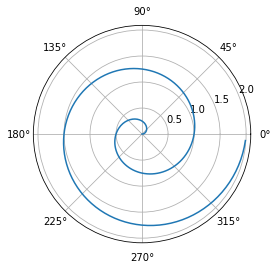

```python
from IPython.core.display import Image
Image('https://www.python.org/static/community_logos/python-logo-master-v3-TM-flattened.png')
```


    

    


```python
print("Welcome to Academic!")
```

    Welcome to Academic!
    


```python
import numpy as np
import matplotlib.pyplot as plt

r = np.arange(0, 2, 0.01)
theta = 2 * np.pi * r
fig, ax = plt.subplots(subplot_kw={'projection': 'polar'})
ax.plot(theta, r)
ax.set_rticks([0.5, 1, 1.5, 2])
ax.grid(True)
plt.show()
```


    

    


## Install Python and JupyterLab

[Install Anaconda](https://www.anaconda.com/distribution/#download-section) which includes Python 3 and JupyterLab.

Alternatively, install JupyterLab with `pip3 install jupyterlab`.

## Create or upload a Jupyter notebook

Run the following commands in your Terminal, substituting `<MY-WEBSITE-FOLDER>` and `<SHORT-POST-TITLE>` with the file path to your Academic website folder and a short title for your blog post (use hyphens instead of spaces), respectively:

```bash
mkdir -p <MY-WEBSITE-FOLDER>/content/post/<SHORT-POST-TITLE>/
cd <MY-WEBSITE-FOLDER>/content/post/<SHORT-POST-TITLE>/
jupyter lab index.ipynb
```

The `jupyter` command above will launch the JupyterLab editor, allowing us to add Academic metadata and write the content.

## Edit your post metadata

The first cell of your Jupter notebook will contain your post metadata ([front matter](https://sourcethemes.com/academic/docs/front-matter/)).

In Jupter, choose _Markdown_ as the type of the first cell and wrap your Academic metadata in three dashes, indicating that it is YAML front matter: 

```
---
title: My post's title
date: 2019-09-01

# Put any other Academic metadata here...
---
```

Edit the metadata of your post, using the [documentation](https://sourcethemes.com/academic/docs/managing-content) as a guide to the available options.

To set a [featured image](https://sourcethemes.com/academic/docs/managing-content/#featured-image), place an image named `featured` into your post's folder.

For other tips, such as using math, see the guide on [writing content with Academic](https://sourcethemes.com/academic/docs/writing-markdown-latex/). 

## Convert notebook to Markdown

```bash
jupyter nbconvert index.ipynb --to markdown --NbConvertApp.output_files_dir=.
```

## Example

This post was created with Jupyter. The orginal files can be found at https://github.com/gcushen/hugo-academic/tree/master/exampleSite/content/post/jupyter
